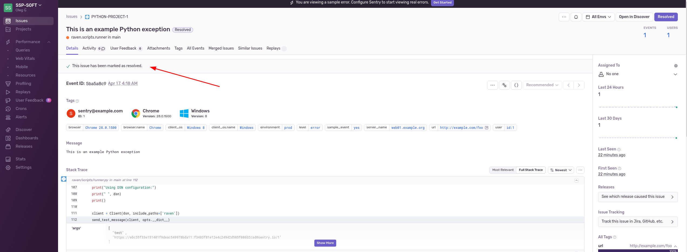
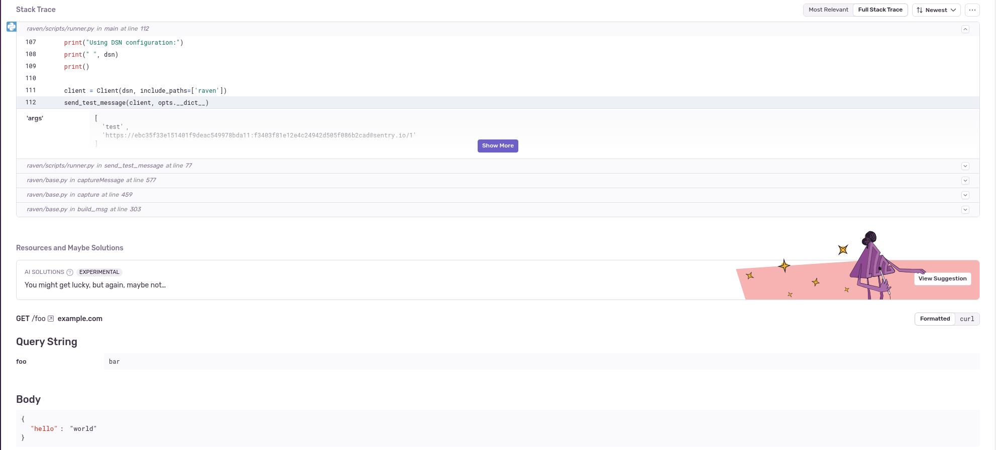
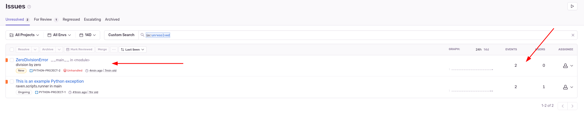

# Домашнее задание к занятию «Платформа мониторинга Sentry» - `Горбачёв Олег`

## Задание 1

Так как Self-Hosted Sentry довольно требовательная к ресурсам система, мы будем использовать Free Сloud account.

Free Cloud account имеет ограничения:

- 5 000 errors;
- 10 000 transactions;
- 1 GB attachments.

Для подключения Free Cloud account:

- зайдите на sentry.io;
- нажмите «Try for free»;
- используйте авторизацию через ваш GitHub-аккаунт;
- далее следуйте инструкциям.

В качестве решения задания пришлите скриншот меню Projects.

## Задание 2

1. Создайте python-проект и нажмите `Generate sample event` для генерации тестового события.
1. Изучите информацию, представленную в событии.
1. Перейдите в список событий проекта, выберите созданное вами и нажмите `Resolved`.
1. В качестве решения задание предоставьте скриншот `Stack trace` из этого события и список событий проекта после нажатия `Resolved`.

## Задание 3

1. Перейдите в создание правил алёртинга.
2. Выберите проект и создайте дефолтное правило алёртинга без настройки полей.
3. Снова сгенерируйте событие `Generate sample event`.
Если всё было выполнено правильно — через некоторое время вам на почту, привязанную к GitHub-аккаунту, придёт оповещение о произошедшем событии.
4. Если сообщение не пришло — проверьте настройки аккаунта Sentry (например, привязанную почту), что у вас не было 
`sample issue` до того, как вы его сгенерировали, и то, что правило алёртинга выставлено по дефолту (во всех полях all).
Также проверьте проект, в котором вы создаёте событие — возможно алёрт привязан к другому.
5. В качестве решения задания пришлите скриншот тела сообщения из оповещения на почте.
6. Дополнительно поэкспериментируйте с правилами алёртинга. Выбирайте разные условия отправки и создавайте sample events. 

## Задание повышенной сложности

1. Создайте проект на ЯП Python или GO (около 10–20 строк), подключите к нему sentry SDK и отправьте несколько тестовых событий.
2. Поэкспериментируйте с различными передаваемыми параметрами, но помните об ограничениях Free учётной записи Cloud Sentry.
3. В качестве решения задания пришлите скриншот меню issues вашего проекта и пример кода подключения sentry sdk/отсылки событий.

---

# Решение домашнего задания

---

## Решение 1

Авторизовался на sentry.io используя мой GitHub-аккаунт.

Скриншот меню Projects:

## Решение 2

1. Создал python-проект и нажал `Create a sample event` для генерации тестового события:

2. Изучил информацию, представленную в событии:

3. Перешел в список событий проекта, выбрал созданное событие и нажал на `Resolve`:

4. Скриншот `Stack trace` из события:

 
Cписок событий проекта после нажатия `Resolved`:

## Решение 3

1. Перешел в создание правил алёртинга.

2. Выбрал проект и создал дефолтное правило алёртинга с указанием канала отправки оповещений:

3. Снова сгенерировал событие `Generate sample event`.

4 - 5. Получил на электронную почту оповещение от алёртинга:

6. Дополнительно поэкспериментировал с правилами алёртинга. Например, настроил правило алёртинга, если задача создана или переведена из состояния "Решенные" в "Не решенные", то через 10 минут в доступные каналы связи, например, электронную почту, придет оповещение:

## Задание повышенной сложности

1 - 3. Создал проект на ЯП Python, для примера взял код из лекции. Подключил к нему sentry SDK и отправьте пару тестовых событий:

Код на Python доступен по ссылке: https://github.com/RikLedger/10-monitoring-05-sentry-hw/blob/main/SRC%20/main.py
